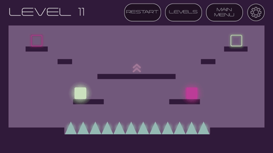

## 🏆 **Achievements**

🥇 We proudly secured **1st place** in the **AI & Technology Academy GameJam 2025** among dozens of creative game projects!

📜 You can view our **official certificate** of achievement here:  
👉 [`Certificate.pdf`](./YZTA-GameJam-2025/Certificate.pdf)

📢 Our winning announcement was featured **live by the jury**, and shared on LinkedIn:  
🔗 [Ömer Faruk Özer's LinkedIn Post with Jury Video](https://www.linkedin.com/posts/omerozerf_mirrorverse-activity-7329817323849039876-iH8k?utm_source=share&utm_medium=member_desktop&rcm=ACoAADdIptUB0iWK15w2DbroQ1yBB7M83oBzDz4)

# 🎮 **Mirrorverse - GameJam 2025 Submission**  
Welcome to **Mirrorverse**, a unique side-scroller puzzle game developed during the **AI & Technology Academy GameJam 2025**.  
This game was created by **Group 6**, consisting of five passionate developers collaborating under pressure and creativity.

---

## 🧑‍💻 **Team Members** 
- **Ömer Faruk Özer**  
- **Nazar Güner**  
- **Funda Ayas**  
- **Rümeysa Akı**  
- **Muhammed Emin Karanfil**

---

## 🌍 **Game Concept**

**Mirrorverse** features two characters in mirrored dimensions.  
Each player input moves one character normally and the other in the reverse direction.  
The goal is to strategically control both characters simultaneously, navigate through obstacles, swap colors via portals, and reach their individual goal zones **at the same time**.

---

## 🧪 **Game Highlights**
- Dual-layered parallel worlds  
- Mirrored controls that challenge coordination  
- Color-switching zones  
- Camera and screen effects  
- Cinematic intro and final scene transitions  

---

## 🛠️ **Built With**
- **Unity (6000.0.45)**  
- **C#**  
- **DOTween**  
- **Cysharp UniTask**  
- **Unity Particle System**

---

## 🎮 **Playable Demo**  
👉 [Play on Itch.io](https://omerozerf.itch.io/yzta-gamejam2025-group6)

---

## 🖥️ **Presentation Slides**  
👉 [View on Canva](https://www.canva.com/design/DAGmaTjmVDQ/-TaaAUtYqDLLrMYtzXbMMw/view?utm_content=DAGmaTjmVDQ&utm_campaign=designshare&utm_medium=link&utm_source=viewer)

---

## 🧠 **Project Structure**
- `PlayerController`: Handles input and mirrored movement  
- `ColorSwitchZone`: Swaps character states  
- `GoalArea`: Checks win conditions  
- `KillZone`: Triggers death and reset  
- `LevelManager`: Controls UI, transitions, and sounds  
- `FinalSequenceManager`: Manages the end-level merge  

---

## 🚀 **To Play in Unity**
1. Open `Assets/_Scenes/__MainMenu`  
2. Hit **Play** in Unity Editor  
3. Control both characters with keyboard input  
4. Solve puzzles through coordinated mirrored control  

---

## 🎬 **Cinematic Touches**
- **Intro**: Spiral animation where two characters split  
- **Finale**: Characters reunite and merge in a smooth center convergence  
- **Scene Transitions**: Custom DOTween-powered effects for entering and exiting levels  

---

## ❤️ **Special Thanks**
To the **AI & Technology Academy** for organizing an inspiring GameJam and bringing developers together in 2025!
